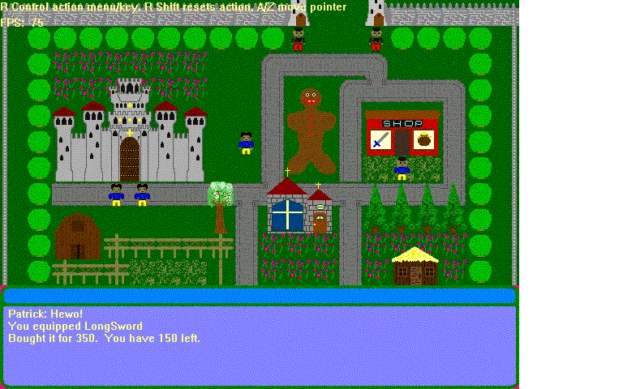



## Megalodon 2D MMORPG

### Description

This is a 2D MMORPG(Client, Server, and editors) I made a few years back, but never put on psc. All info can be found in the Alpha Release.txt located in the Server folder. Enjoy!
 
### More Info
 
Read the Alpha Release.txt(It's in the Server folder) BEFORE using! I AM NOT RESPONSIBLE FOR ANYTHING THAT HAPPENS TO YOUR COMPUTER BY USING THIS SOFTWARE!

This is an unfinished ALPHA. It may be unstable.

             |
---                |---
**Submitted On**   |2002-06-04 11:15:50
**By**             |[Patrick Rogers\-Ostema](https://github.com/Planet-Source-Code/PSCIndex/blob/master/ByAuthor/patrick-rogers-ostema.md)
**Level**          |Intermediate
**User Rating**    |5.0 (15 globes from 3 users)
**Compatibility**  |VB 6\.0
**Category**       |[DirectX](https://github.com/Planet-Source-Code/PSCIndex/blob/master/ByCategory/directx__1-44.md)
**World**          |[Visual Basic](https://github.com/Planet-Source-Code/PSCIndex/blob/master/ByWorld/visual-basic.md)
**Archive File**   |[Megalodon\_1694951152004\.zip](https://github.com/Planet-Source-Code/patrick-rogers-ostema-megalodon-2d-mmorpg__1-51038/archive/master.zip)

